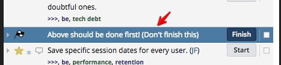

### Stories ###

This part of the docs concerns the stories on Pivotal Tracker and how we work with them. This document will contain certain rules and guidelines to ensure that all members of the team can use the stories effectively.

* * *

#### Adding stories ####
All members of the development team, including members of the marketing & sales team, are allowed (and encouraged) to add their own stories.
They will then be the __requester__ (and thereafter __accepters__) of the story and responsible for adding __a clear description__ and a __screenshot, if applicable__.
All new stories will be added to the icebox.

There are a couple of guidelines when it comes to creating stories:
* __Write a clear description and title__: Each story should be written as though the owner of the story is completely unaware of this feature, chore or bug. The owner of the story is allowed to reject the story if it is unclear what needs to be done.
* __If it's a bug...__: Use Bugherd and supply a screenshot.
* __Use proper punctuation__: Capital letters, proper use of comma's, no all-caps, etc.
* __Use understandable words__: Don't use words that are obscure and very uncommon. This prevents basic miscommunication.
* __Always assign the story__: Specifically, assign them to Joey. Unassigned stories won't be found and won't be scheduled.
* __Add tasks, if applicable__: Are there specific tasks concerning this story? Add them.

Members of the dev team can assign ownership of the ticket themselves and, if they are able, should __add sufficient tasks__ to the story as well.
Upon scheduling the story, the scrum-master will assign an owner to the story.

* * *

#### Pricing stories (assigning points to them)####
The scrum-master is in charge of [assigning points to each story](#points). If however the scrum-master doesn't feel confident in assigning points to a story, he will consult a member of the team. If however a member of the development team is adding a story and he is confident he can price the story accurately, this is highly encouraged.

We use a Fibonacci point system that looks this:
* __0 points:__ Quick fixes or implementations, everything from 1 minute to 15 minutes
* __1 points:__ Quick fixes or implementations, everything from 15 minutes to 1 hour
* __2 points:__ Small features, something that will take a couple of hours
* __3 points:__ Medium features, somethat that could take half a day
* __5 points:__ Large features, features where it's unsure how much time will be needed, but a medium-to-long time regardless
* __8 points:__ Extra Large, risky features where it's unsure how much time will be needed, but a long time regardless

It's important to note that the points do not have a direct link to time, but rather effort.

If at any point any member of the development team notices that a story is not priced correctly, it is adviced to change the pricing to more accurately reflect the amount of effort needed.

* * *

#### Scheduling stories (putting them into the backlog) ####
The scrum-master, having consulted with the product owner, will put all stories for the coming sprint in the backlog on friday.
Only the scrum-master or product owner is allowed to schedule stories. Never start on a story that wasn't discussed and that isn't part of the current sprint.

Stories will not be scheduled for the current sprint, during a sprint. In other words, the current sprint won't be broken unless absolutely necesarry and approved by the product owner.

* * *

#### Prioritisation ####
There are two ways that we have deciced to indicate priority in Pivotal Tracker; priority labels and above-the-line stories.

We use labels to separate labels based on priority. We have come up with the following 3-point system:
* `>` - Low priority
* `>>` - Medium priority
* `>>>` - High priority
These labels make it easy to find stories in the icebox that are important or have a high impact, and this also makes it easier for the developers to distinguish between stories.

For stories that are scheduled, we have an additional way to indicate priority; In the current log we use a Deadline story (a bright blue bar in the log) as a type of separator. All stories scheduled and placed above this blue bar need to be taken care of first. Afterwards, the priority labels mentioned above take over and the developers are allowed to decide which one they tackle.

Prioritisation is added by the scrum-master or product owner. It is not encouraged to add priority labels yourself, unless previously discussed with the product owner.

* * *

##### Accepting stories #####
Only requesters of the story are allowed to accept a story.
This is to prevent miscommunication and to ensure that the requester has seen the desired results.

On some occasions, the scrum-master will be allowed to accept stories, in communication with the requester and clear understanding of the story.

* * *

##### Rejecting stories #####
Only requesters of the story are allowed to reject a story. Before a story is rejected, the requester or reviewer is encouraged to consult with the developer responsible first, to make sure that the requirements were clear and were thus not met.

Reasons to reject a story:
* __Requirements were not met__: The story did not solve the given issue or did not implement the feature like how it was described.

Reasons to __NOT__ reject a story:
* __The scope of the story has changed__: If the scope has changed and requirements were either added or changed, then this is to be submitted in a new story.
* __The requester meant something different__: It is the responsiblity of the requester to properly describe each story. If the developer did not understand it and proper explanations were not given, the developer will be given the time to correct this.
